# Naimi Presentation Kit

**Build interactive, personalized web presentations and proposals with your AI agent** —
Claude Code, Cursor, Codex, or any coding agent.

This kit replaces the static PDF/PPTX you'd normally email with a **live web
presentation**: calculators, sliders, package pickers, embedded video, special
offers — personalized per client and sent as **one link** that opens without any
login. Describe what you want in plain words; your agent builds it.

Not AI-assisted. **AI-run**: the agent doesn't just draft slides — it builds,
previews, publishes and personalizes presentations end-to-end from the same chat
you already work in.

- 🆓 **Everything in this repo works locally, no account needed** — build,
  preview and iterate on presentations forever.
- 🔗 A free [Naimi](https://app.naimi.ai/app/signup) account is only needed when
  you want to **send** a presentation: it turns your local deck into per-client
  personalized presentations with tracked links (who opened, when, for how long),
  open notifications and a lightweight client CRM.

## Quick start

```bash
git clone https://github.com/naimi-ai/presentation-kit.git
cd presentation-kit
```

Open your AI agent in this folder and just talk to it:

```
claude   # or cursor / codex — the agent picks up AGENTS.md automatically
```

> *"Build me a proposal for my design studio — three pricing stages and a
> signature block. Here's our logo."*

The agent reads the kit skills, scaffolds the project, writes the slides, runs
the local preview and shows you the result. You never touch npm, React or config
files — but all of it is here if you want to (see
[Manual use](#manual-use-without-an-agent)).

**Requirements:** [Node.js](https://nodejs.org) ≥ 20.19 and an AI coding agent.

## Ready-made templates

18 templates in different genres, each with its own design system and
personalization mechanics. Click any preview to open a **live example** —
that's a real personalized presentation, exactly what your client would receive.

<table>
  <tr>
    <td align="center"><a href="https://app.naimi.ai/ridgeline-outfitters-7330bd">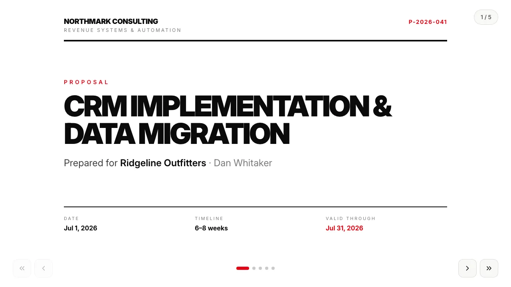<br/><b>Service proposal — Swiss mono</b></a><br/>staged pricing, terms, validity</td>
    <td align="center"><a href="https://app.naimi.ai/bluebird-coffee-roasters-b8b367">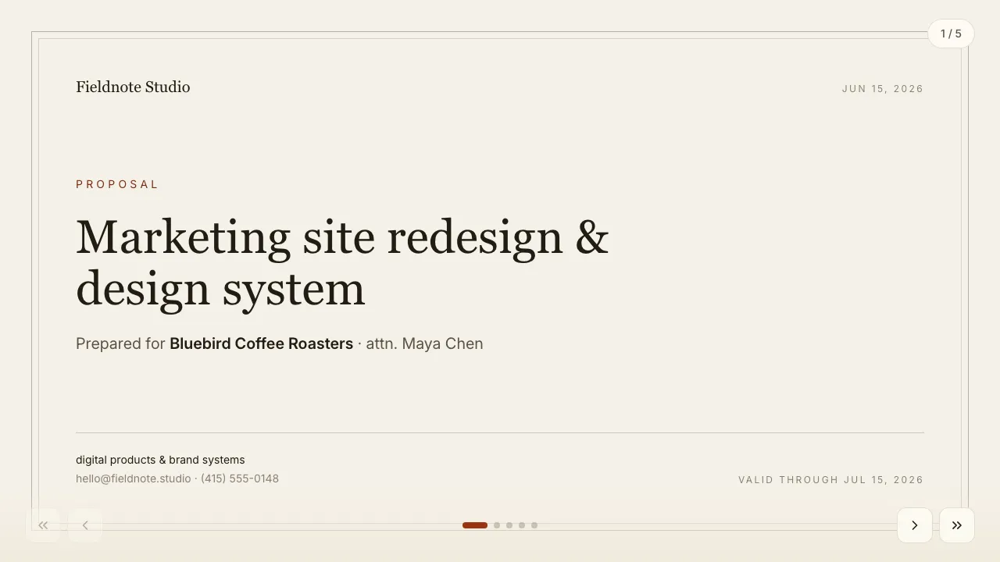<br/><b>Studio proposal — paper</b></a><br/>stage estimate, signature block</td>
    <td align="center"><a href="https://app.naimi.ai/truenorth-logistics-42fd87">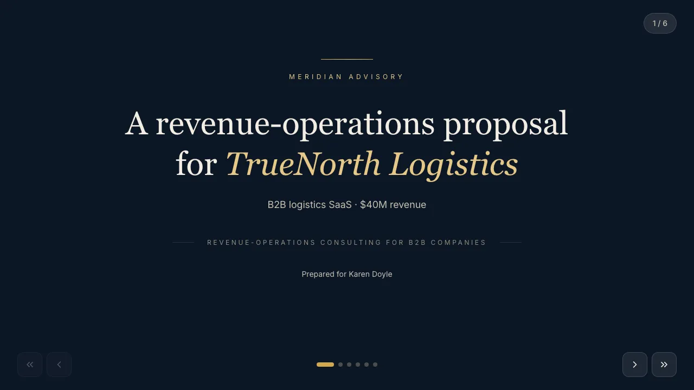<br/><b>B2B services — dark premium</b></a><br/>practices, priority picker</td>
  </tr>
  <tr>
    <td align="center"><a href="https://app.naimi.ai/emma-noah-sullivan-89a06b">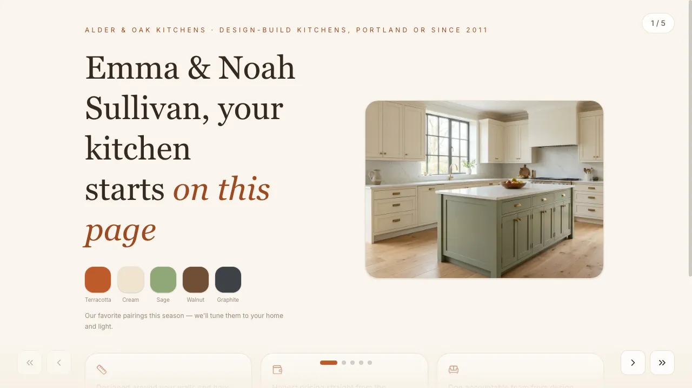<br/><b>Kitchen remodel proposal</b></a><br/>live configurator with financing</td>
    <td align="center"><a href="https://app.naimi.ai/the-hendersons-c711e0">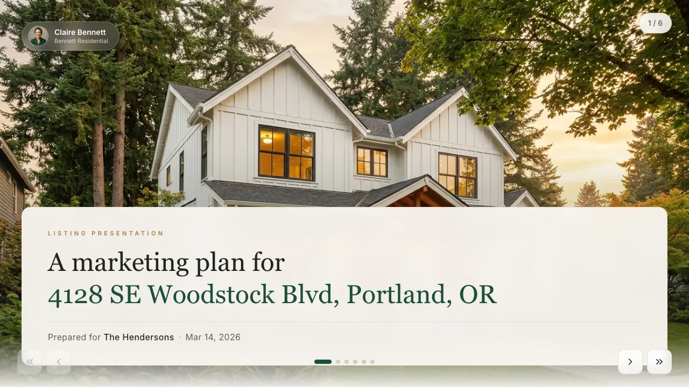<br/><b>Real-estate listing</b></a><br/>comps, net-proceeds calculator</td>
    <td align="center"><a href="https://app.naimi.ai/sarah-james-ac5f35">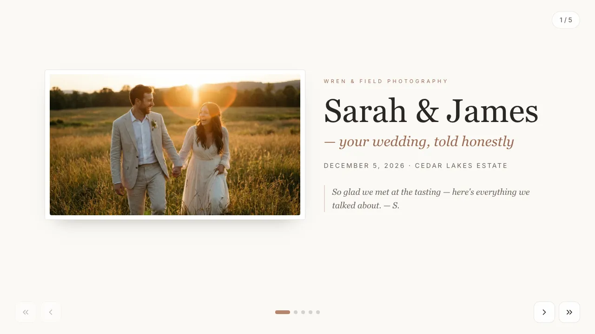<br/><b>Wedding photography packages</b></a><br/>client picks package &amp; add-ons</td>
  </tr>
  <tr>
    <td align="center"><a href="https://app.naimi.ai/harbor-main-home-goods-ffaff3">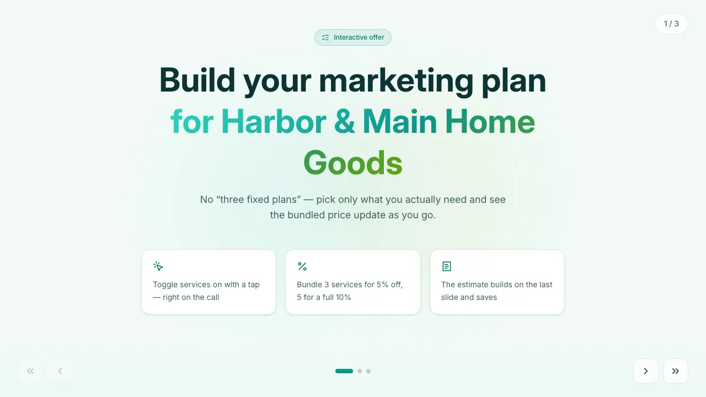<br/><b>Service menu configurator</b></a><br/>checkboxes, bundle discount, total</td>
    <td align="center"><a href="https://app.naimi.ai/juniper-skincare-85096f">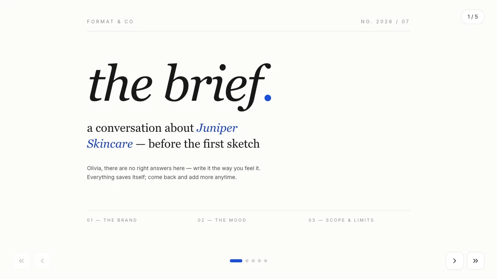<br/><b>Design studio brief</b></a><br/>client self-fill: moodboard, budget</td>
    <td align="center"><a href="https://app.naimi.ai/summit-gear-co-3ec859">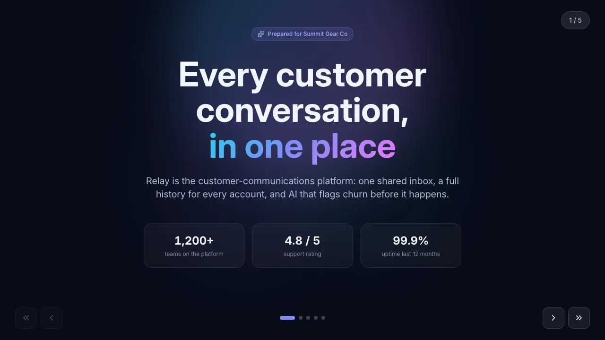<br/><b>SaaS product pitch</b></a><br/>plan / seats / billing choice</td>
  </tr>
  <tr>
    <td align="center"><a href="https://app.naimi.ai/crestview-capital-4417b0">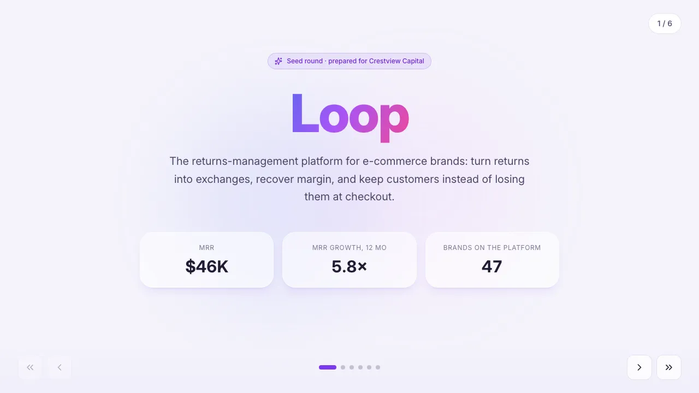<br/><b>Investor pitch deck</b></a><br/>ticket slider, traction chart</td>
    <td align="center"><a href="https://app.naimi.ai/tony-ramirez-df362c">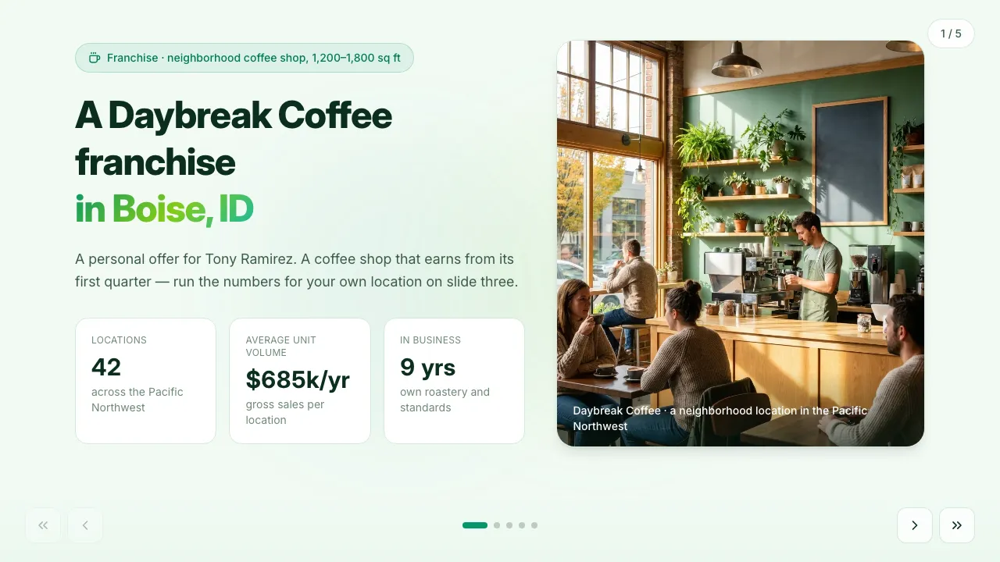<br/><b>Franchise offer</b></a><br/>payback calculator</td>
    <td align="center"><a href="https://app.naimi.ai/summit-gear-co-40f2e6">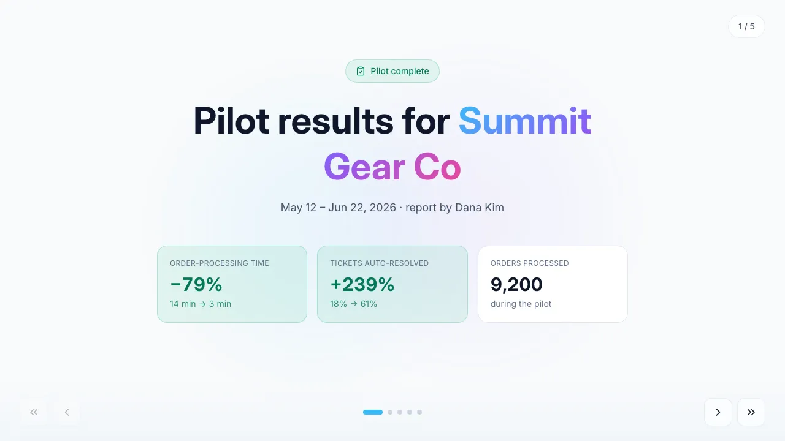<br/><b>Pilot results report</b></a><br/>before/after metrics, SVG chart</td>
  </tr>
  <tr>
    <td align="center"><a href="https://app.naimi.ai/harbor-main-home-goods-589807">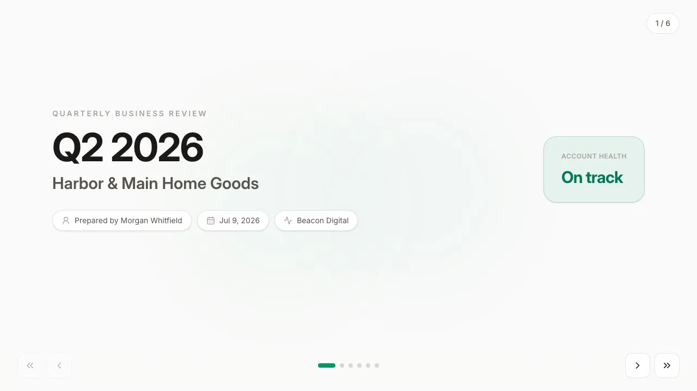<br/><b>Quarterly business review</b></a><br/>KPI grid, client rating self-fill</td>
    <td align="center"><a href="https://app.naimi.ai/summit-gear-co-a40c05">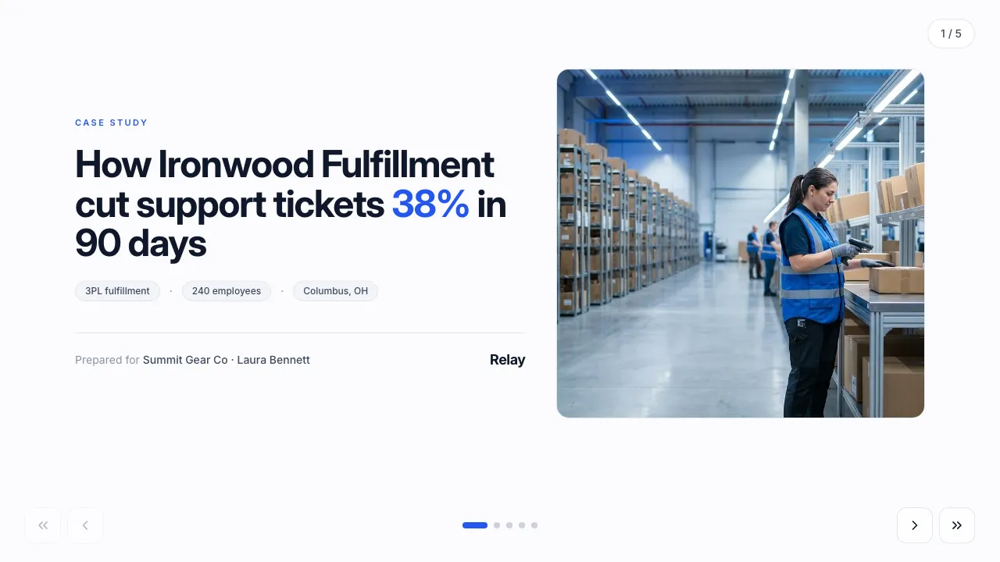<br/><b>Case study — customer story</b></a><br/>prospect's own savings projection</td>
    <td align="center"><a href="https://app.naimi.ai/northwind-software-df9004">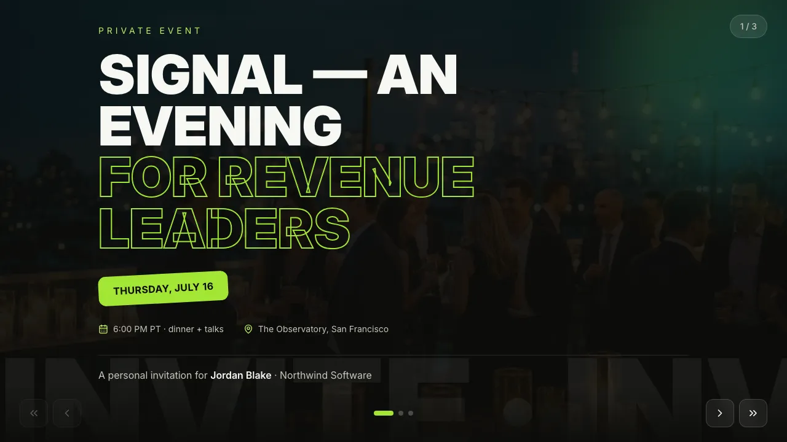<br/><b>Event invitation</b></a><br/>RSVP, add-to-calendar</td>
  </tr>
  <tr>
    <td align="center"><a href="https://app.naimi.ai/atlas-payments-a45950">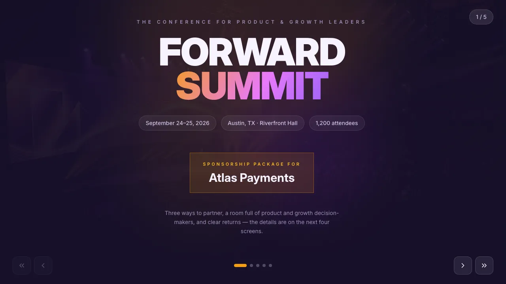<br/><b>Event sponsorship package</b></a><br/>tier picker, benefits matrix</td>
    <td align="center"><a href="https://app.naimi.ai/ridgeline-outfitters-e843c0">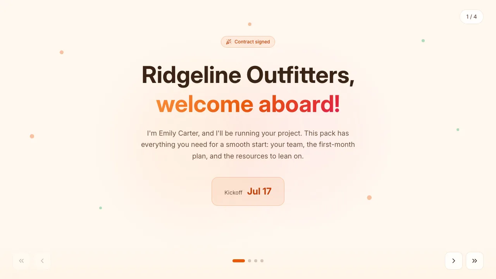<br/><b>New-client welcome pack</b></a><br/>30-day plan from kickoff date</td>
    <td align="center"><a href="https://app.naimi.ai/jamie-rivera-4750f5">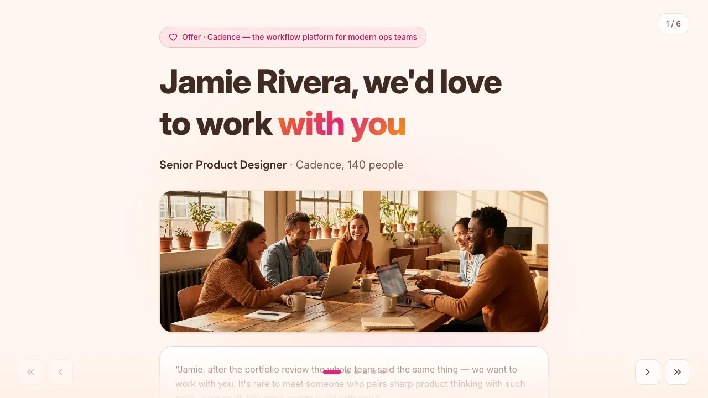<br/><b>Job offer to a candidate</b></a><br/>total comp, candidate replies inline</td>
  </tr>
</table>

Every template is a **starting point**, not a locked design: your agent can
restyle it, rewrite it, or rebuild your existing PDF/PPTX/website into slides
from scratch.

## How it works

1. **Build a template once.** A template is a reusable presentation blueprint —
   slides, design, and which fields get filled in per client (company name,
   contact, prices, dates, a full priced estimate…). Start from a ready-made
   deck, from scratch, or from your own materials — the agent reads a PDF, a
   slide deck, screenshots, even a photo of a napkin sketch, and rebuilds it.
2. **Preview locally.** `npm run dev` renders the deck with mock data — iterate
   with your agent until it looks right. No account, no upload.
3. **Publish & personalize** *(free account)*. The agent uploads the template to
   Naimi, then makes a **presentation per client in seconds**: *"create a
   presentation for Acme with a 15% discount until Friday"* → you get back one
   link. It even works from messy input — a call transcript, meeting notes, a
   chat export.
4. **The signal comes back.** The client opens the link without any login; you
   see opens, view time and what they answered in interactive fields — with
   notifications the moment it happens. Everything learned lands on the client's
   CRM card and pre-fills their next presentation.

## What's in the box

| Path | What it is |
|---|---|
| `START-HERE.md` | Agent entry point: the product in plain language + routing to the skills |
| `TEMPLATE-SKILL.md` | Agent skill: build/edit a template locally, preview, themes, images |
| `PUBLISH-SKILL.md` | Agent skill: validate, package and upload a template to the service |
| `PRESENTATIONS-SKILL.md` | Agent skill: create per-client presentations, stats, deal status, CRM — pure API |
| `template/` | The starter project (React + Vite + Tailwind + framer-motion) — what every presentation is built from |
| `decks/<id>/` | 18 ready-made templates as drop-in overlays (slides + manifest + mock data) |
| `scripts/build-deck.mjs` | Build any ready-made deck into an uploadable ZIP in one command |

The skills are written for agents that support instruction files
(`AGENTS.md`/`CLAUDE.md` are picked up automatically by Claude Code, Cursor,
Codex and most others). If your agent supports installable skills, install the
four `*-SKILL.md` files and it will pick the right one per request.

## Manual use (without an agent)

The kit is a normal codebase — you can work with it directly:

```bash
cd template
npm install
npm run dev        # local preview with mock data; /#gallery shows components & themes
npm run package    # build + validate → <id>.zip
```

`template/README.md` documents the structure, the manifest contract and the
slide API. To start from a ready-made deck, overlay `decks/<id>/` onto a copy of
`template/` (or run `node scripts/build-deck.mjs <id>` to produce an uploadable
ZIP directly).

## Do I need an account?

| | Without an account | With a free account |
|---|---|---|
| Build & edit templates locally | ✅ | ✅ |
| Preview with mock data | ✅ | ✅ |
| Publish a template to the service | — | ✅ |
| Per-client personalized presentations via one link | — | ✅ |
| Open & view tracking, notifications | — | ✅ |
| Client self-fill answers + client CRM | — | ✅ |

Sign up at **[app.naimi.ai](https://app.naimi.ai/app/signup)** (free plan, no
card). Then create an API token at *Authoring → API tokens* and hand it to your
agent — that's the only setup it needs.

## Links

- **Service:** [app.naimi.ai](https://app.naimi.ai)
- **Website:** [naimi.ai](https://naimi.ai)

## License

The kit — starter, ready-made templates and agent skills — is released under the
[MIT License](LICENSE). Build on it freely, including for commercial client
work. (The Naimi service itself is a separate product and is not part of this
repository.)
